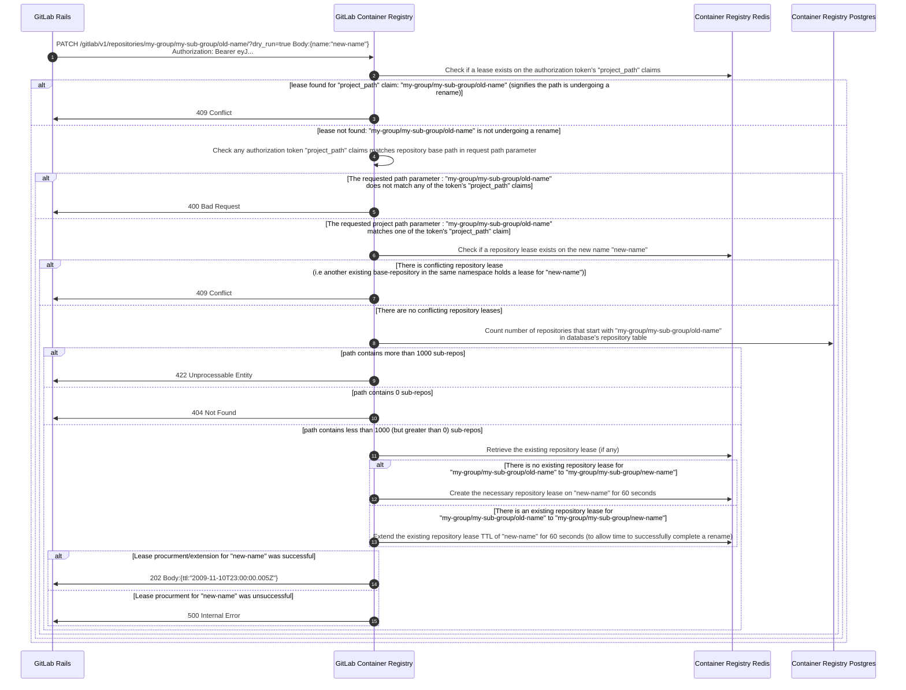
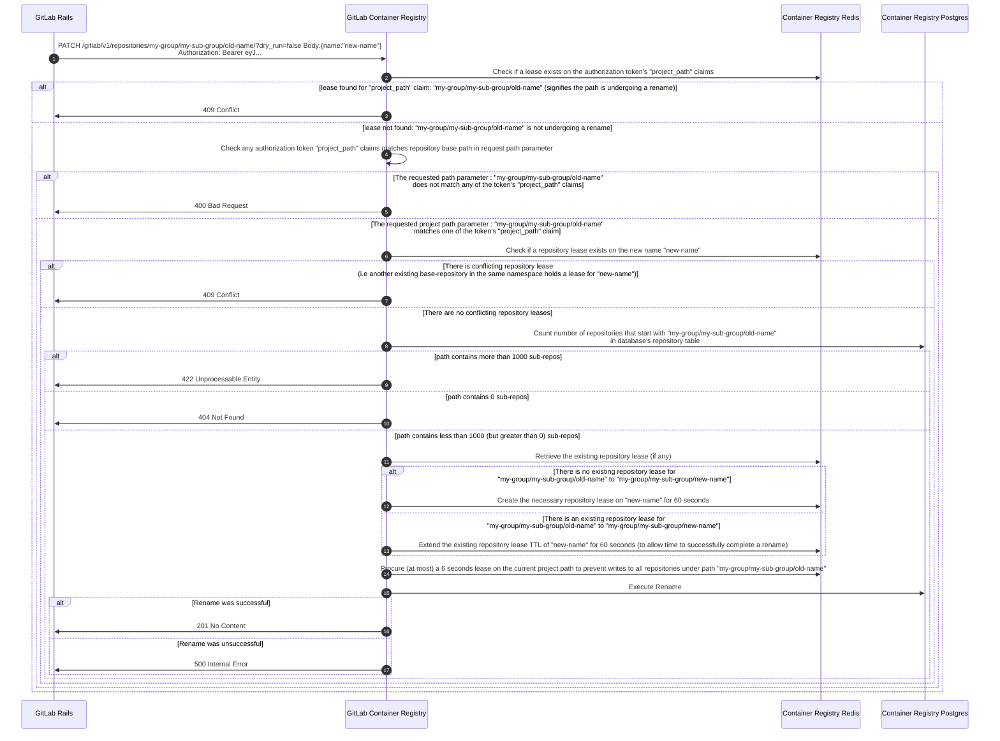
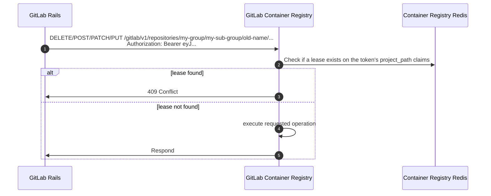
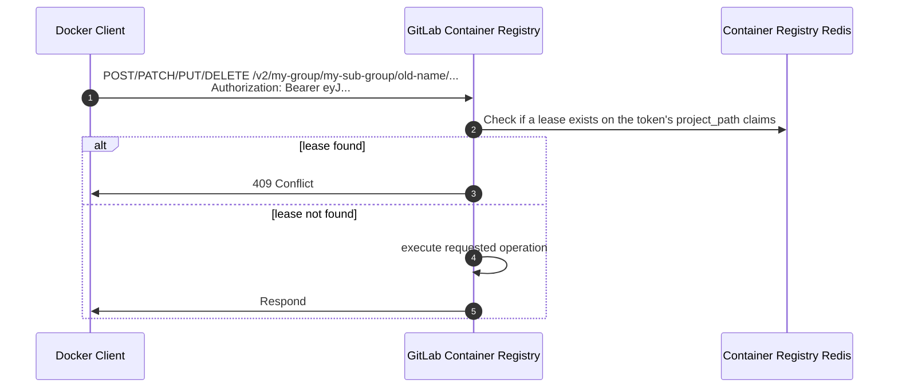

# Request Flow

This document illustrates the flow of the API request for GitLab Rails to rename a project with container repositories.

This flow works under the assumption that all Authorization tokens referenced in the diagram have been issued to GitLab Rails with full sub-repository pull scopes and base-repository push & pull scopes.

**Note** : When making a request to the rename API GitLab Rails must pass the project path in place of the repository (base) `<path>` parameter in the request. This is because some repositories may not have a base repository (i.e. a repository with the same exact path as the GitLab project) but may have sub repositories under the GitLab project path, which would still need to be renamed.

## Rename (Dry-run)

## Rename

## Ongoing Rename Effect On APIs That Write To Repositories

